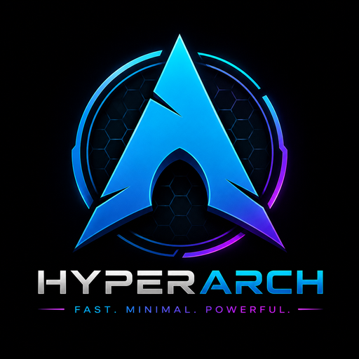

<div align="center">



**Estación de trabajo Linux con IA de sistema integrada**

Arch · Hyprland · Btrfs · ROCm · Docker

[English](README.md) · **Español**

</div>

---

> **Estado: alfa.** El instalador **borra el disco completo**. No lo ejecutes sobre
> datos que no puedas perder.

## Qué es

Una distribución basada en Arch construida para una estación concreta —Ryzen 9 7900X3D,
Radeon RX 7900 XTX y 64 GB de RAM— con tres ideas que la diferencian:

**Cristal fuera, producción dentro.** El escritorio es deliberadamente espectacular
—negro absoluto, cristal translúcido, rojo carmesí, animaciones a 144 Hz— hasta que
abres una herramienta de trabajo. Entonces desaparece el blur, la transparencia y las
animaciones largas, y el sistema entra en Modo Producción automáticamente. Al cerrar
la última app de trabajo, vuelve solo.

**IA que optimiza, no que estorba.** Un modelo local analiza la telemetría cada dos
minutos y ajusta el sistema. Solo aplica acciones reversibles y acotadas; todo lo
demás lo registra como sugerencia. Y si el modelo no está disponible, una capa de
reglas deterministas sigue funcionando: la IA nunca es punto único de fallo.

**Consciente de su hardware.** El 7900X3D tiene dos CCD asimétricos —uno con 3D
V-Cache, otro con más frecuencia—. Windows lo gestiona con un driver propio; aquí se
controla explícitamente con `hyper-ccd`. Los subvolúmenes de Docker y de los modelos
de IA se crean sin copy-on-write, porque son ficheros grandes y ya comprimidos que
bajo CoW se fragmentan mal.

## Requisitos

| | |
|---|---|
| Para construir | Windows/Linux/macOS con Docker, 20 GB libres |
| Para instalar | CPU x86-64, UEFI, GPU AMD, 16 GB RAM mínimo, SSD 256 GB mínimo |
| Recomendado | Ryzen 9 7900X3D · RX 7900 XTX · 64 GB · NVMe 4 TB |

## 1 · Construir la ISO

Desde Windows con Docker Desktop en marcha:

```bash
git clone https://github.com/ProgramerJr/HyperArch.git
cd HyperArch
./build.sh --check     # verifica requisitos
./build.sh             # construye (20-40 min)
```

La ISO aparece en `out/` junto a su `SHA256SUMS`.

## 2 · Probar en máquina virtual (hazlo primero)

```bash
./test-vm.sh --with-disk    # arranca la ISO con un disco virtual desechable de 40 GB
# dentro del entorno live:
sudo hyperarch-install /dev/vda
./test-vm.sh --boot-disk    # arranca el sistema instalado
```

## 3 · Grabar el USB

Con [Rufus](https://rufus.ie):

- Esquema de partición: **GPT**
- Sistema destino: **UEFI (no CSM)**
- Modo de escritura: **DD Image**

## 4 · Instalar en hardware real

En la BIOS: desactiva **Secure Boot** y arranca desde el USB.

```bash
lsblk                                # identifica tu disco
sudo hyperarch-install /dev/nvme0n1  # BORRA TODO ese disco
```

El instalador crea el layout Btrfs, instala el sistema base, configura GRUB con
menú de snapshots y deja todo listo. Reinicia al terminar.

## 5 · Primer arranque

```bash
hyper-setup
```

Instala VS Code (con tres perfiles aislados), Brave, lazydocker, LACT y descarga el
modelo de IA. Luego rellena tus credenciales:

```bash
nano ~/.config/hyperarch/tokens.env
```

## Atajos

`SUPER` es la tecla Windows. Los niveles de modificador tienen significado:
`SUPER` lanza, `SUPER+SHIFT` es la variante secundaria, `SUPER+ALT` es geometría.

| | | | |
|---|---|---|---|
| `SUPER+RETURN` | Terminal | `SUPER+H` | Hyper Hub |
| `SUPER+R` | VS Code · React | `SUPER+M` | Monitor (btop) |
| `SUPER+J` | VS Code · Java | `SUPER+SHIFT+M` | GPU (nvtop) |
| `SUPER+O` | VS Code · DevOps | `SUPER+I` | Panel de IA |
| `SUPER+G` | lazygit | `SUPER+P` | **Modo Producción** |
| `SUPER+D` | lazydocker | `SUPER+Z` | **Modo Foco** |
| `SUPER+SHIFT+D` | MongoDB Compass | `SUPER+SPACE` | Lanzador |
| `SUPER+B` | Navegador | `SUPER+E` | Archivos |
| `SUPER+S` | Steam | `SUPER+L` | Bloquear |

Workspaces: 1 terminal · 2 editor · 3 navegador · 4 datos · 5 monitor · 9 juegos.

## Comandos

```bash
hyper-hub                    # centro de control
hyper-hub --watch            # en vivo
hyper-production-mode benchmark   # mide el ahorro real de GPU
hyper-profile dev|ai|gaming|silent
hyper-ccd info               # topología de CCD del 7900X3D
hyper-ccd cache <programa>   # fijar al CCD con V-Cache
hyper-help                   # chuleta de atajos (también SUPER+F1)
hyper-ai ask "¿va lento?"    # preguntar a la IA con telemetría en vivo
hyper-ai review              # qué ha hecho y sugerido la IA
hyper-new react|java|api     # crear proyecto con el stack completo
hyper-secrets init|edit      # cifrar credenciales en reposo (GPG)
hyper-update                 # snapshot → sistema → AUR → limpieza
hyper-backup run             # copia de seguridad (disco externo)
hyper-wallpaper engine <id>  # fondo animado de la Workshop
mongo-up / mongo-down        # MongoDB en contenedor
snap-list                    # snapshots del sistema
hai                          # log de la IA en vivo
```

## Cómo funciona la IA

```
        ┌─────────────────────────────────────┐
        │  Telemetría: CPU · RAM · GPU · disco │
        └────────────────┬────────────────────┘
                         │
        ┌────────────────▼────────────────┐
        │  Capa 1 · Reglas deterministas  │  ← siempre activa
        │  renice · swappiness · caché    │     sin modelo
        └────────────────┬────────────────┘
                         │
        ┌────────────────▼────────────────┐
        │  Capa 2 · LLM local (opcional)  │  ← enriquece
        │  diagnóstico · patrones         │     nunca imprescindible
        └────────────────┬────────────────┘
                         │
              ┌──────────┴──────────┐
              ▼                     ▼
         AUTO (reversible)    SUGERENCIA (solo log)
```

No existe una categoría de acción destructiva automática. Por diseño.

## Estructura

```
hyperarch.toml       configuración central
build.sh             constructor de la ISO
packages/            listas de paquetes por categoría
airootfs/            overlay que se copia al sistema
  etc/skel/.config/  dotfiles del usuario
  usr/local/bin/     herramientas hyper-*
installer/           instalador de disco
```

## Recuperación

Si una actualización rompe el sistema, arranca desde GRUB →
*HyperArch snapshots* y elige una anterior. `@var_log` y `@var_cache` quedan fuera
del rollback a propósito: así conservas los logs que explican qué falló.

## Limitaciones conocidas

- **League of Legends no funciona**, ni con Proton ni en máquina virtual. Vanguard
  exige atestiguar la cadena de arranque física y rechaza toda virtualización. Si lo
  necesitas, instala Windows en un disco aparte.
- Sin cifrado de disco. Decisión consciente: prioriza la simplicidad de recuperación
  por snapshots. Los secretos se protegen a nivel de aplicación.
- Sin hibernación (requeriría 64 GB de swap y choca con el layout sin CoW).
- Probado únicamente sobre hardware AMD.

## Fondos animados

Wallpaper Engine es software de Windows; HyperArch usa el renderizador comunitario
[linux-wallpaperengine](https://github.com/Almamu/linux-wallpaperengine). Necesitas
Wallpaper Engine en Steam (los fondos de la Workshop van ligados a la licencia).
Recomendado para el tema Crimson: el fondo `1180974281` ("Black and red Abstract").
El Modo Producción vuelve solo al fondo estático — un fondo animado es exactamente
el coste de GPU que ese modo existe para eliminar.

## Contribuir

Lee [CONTRIBUTING.md](CONTRIBUTING.md). Issues y PRs bienvenidos en español o inglés.

## Licencia

MIT
